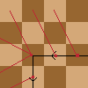

# OEIS A323809

To preview this file, I recommend opening README.html in a browser.
The visual studio code extension [Markdown+Math] is used to render the equations.

## Definition

$P_n(x)$ means that the $n$-th position of the knight is $x$. The starting position of the knight is $1$, meaning that $P_1(1)$ is true.

$V_n$ is the set of all visited positions, defined as $\{ x | \exists k \leq n: P_k(x) \}$. For any position $x$ we define $V_n(x)$ to mean $x \in V_n$.

$N(x, y)$ means that there exist a step from $x$ to $y$.

$N_{small}(x, y) \Leftrightarrow \forall q \neq y: N(x, q) \Rightarrow q > y$. As the knight always moves to its smallest unvisited neighbor,  we know that $N_{small}(x, y) \land P_n(x) \land \neg V_n(y) \Rightarrow P_{n+1}(y)$.

## All unreachable sets must be infinite

> More formally, let us call "isolated" a set of unvisited squares which is connected through knight moves, but which cannot be extended to a larger such set by adding a further square. Can there exist at some moment a finite isolated set which the knight cannot reach? (Without the last condition, the square a(2016) would clearly satisfy the condition just before the knight reaches it.)

There cannot be a finite isolated set which the knight cannot reach.

If a position $x$ is unreachable, $\neg V_{\infty}(x)$ must hold.

Every square $s$ has a neighbor $n$ such that $N_{small}(n, s) \land n > s$.

$$
\neg V_{\infty}(s) \land N_{small}(n, s) \Rightarrow \neg V_{\infty}(n)
$$

Using mathematical induction, we can therefore prove
that any unreachable position must be part of an infinite unreachable set $X$
with $\forall p \in X: \exist q: N_{small}(q, p)$.

## No unreachable set can exist (Not yet proven)

> At move 99999, the least yet unvisited square has number 66048, which is near the border of the visited region. This suggests that the knight will eventually visit every square. Can this be proved or disproved through a counter-example?

The knight will eventually visit every square.

The knight goes in circles around the origin (TODO: prove), meaning that there must not be a wall of $p \in X$.
Looking at the smallest $s$ which is not visited, this is impossible (TODO: prove).

[Markdown+Math]: https://marketplace.visualstudio.com/items?itemName=goessner.mdmath
